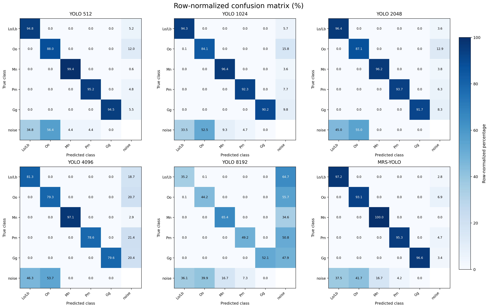
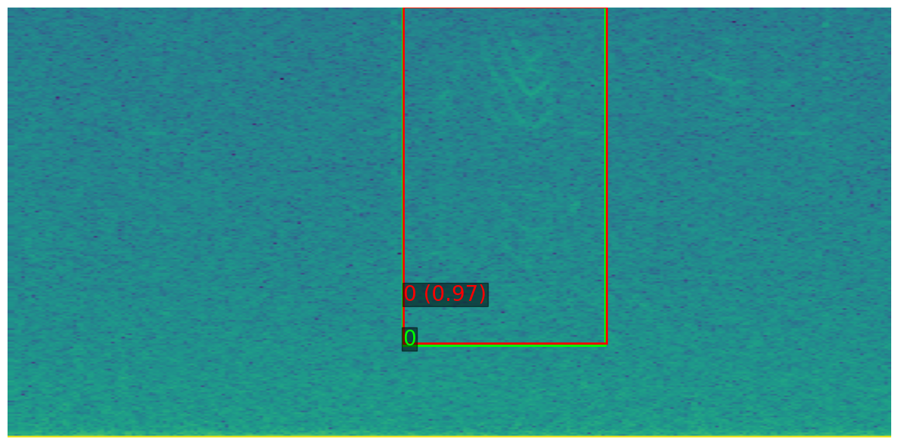
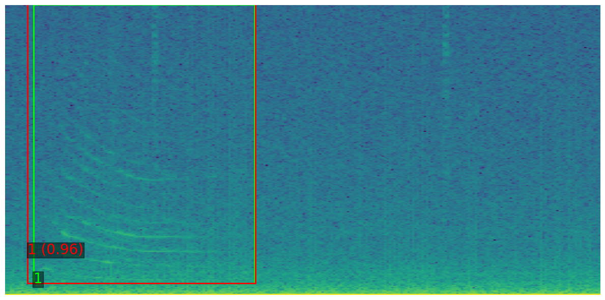
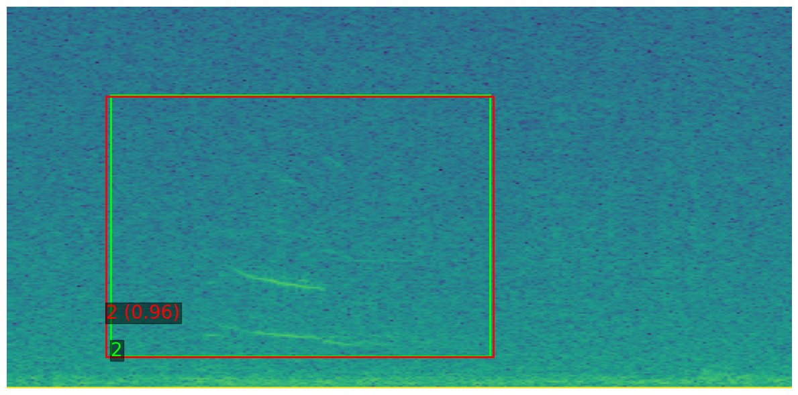
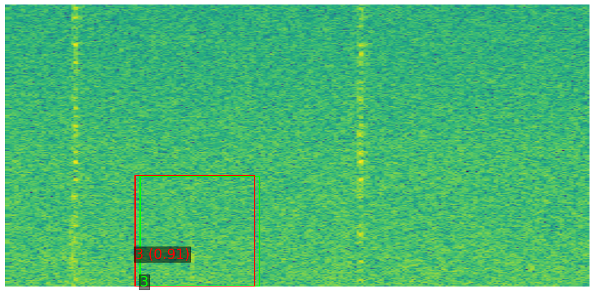

**Table 1.** Detection performance on the ONC acoustic dataset across degradation levels.

| Model | Initial R@0.9P | Initial mAP50 | Initial mAP50:95 | Moderate Noise R@0.9P | Moderate Noise mAP50 | Moderate Noise mAP50:95 | Strong Noise R@0.9P | Strong Noise mAP50 | Strong Noise mAP50:95 | Very Strong Noise R@0.9P | Very Strong Noise mAP50 | Very Strong Noise mAP50:95 |
| --- | ---: | ---: | ---: | ---: | ---: | ---: | ---: | ---: | ---: | ---: | ---: | ---: |
| YOLO (512) | 0.934 | 0.925 | 0.897 | 0.409 | 0.224 | 0.217 | 0.236 | 0.133 | 0.128 | 0.046 | 0.002 | 0.002 |
| YOLO (1024) | 0.921 | 0.903 | 0.876 | 0.374 | 0.408 | 0.371 | 0.242 | 0.268 | 0.248 | 0.126 | 0.102 | 0.097 |
| YOLO (2048) | 0.941 | 0.934 | 0.886 | 0.375 | 0.032 | 0.030 | 0.199 | 0.010 | 0.009 | 0.132 | 0.068 | 0.062 |
| YOLO (4096) | 0.854 | 0.833 | 0.696 | 0.280 | 0.017 | 0.016 | 0.192 | 0.147 | 0.130 | 0.109 | 0.000 | 0.000 |
| YOLO (8192) | 0.368 | 0.440 | 0.284 | 0.105 | 0.069 | 0.055 | 0.065 | 0.012 | 0.011 | 0.035 | 0.019 | 0.016 |
| **MRS-YOLO** | **0.962** | **0.956** | **0.931** | **0.591** | **0.589** | **0.563** | **0.463** | **0.458** | **0.431** | **0.247** | **0.008** | **0.007** |

**Figure 1.** Row-normalized confusion matrix (%) on the clean acoustic dataset.

**Figure 2.** Qualitative examples on the ONC acoustic dataset: Delphinidae (Lo/Lb).

**Figure 3.** Qualitative examples on the ONC acoustic dataset: Orcinus orca (Oo).

**Figure 4.** Qualitative examples on the ONC acoustic dataset: Megaptera novaeangliae (Mn).

**Figure 5.** Qualitative examples on the ONC acoustic dataset: Physeter macrocephalus (Pm).

