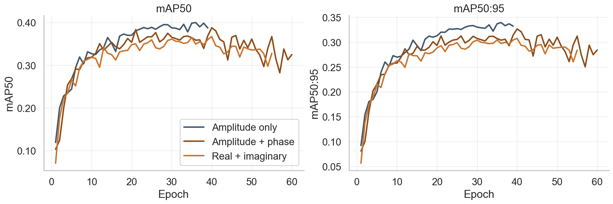
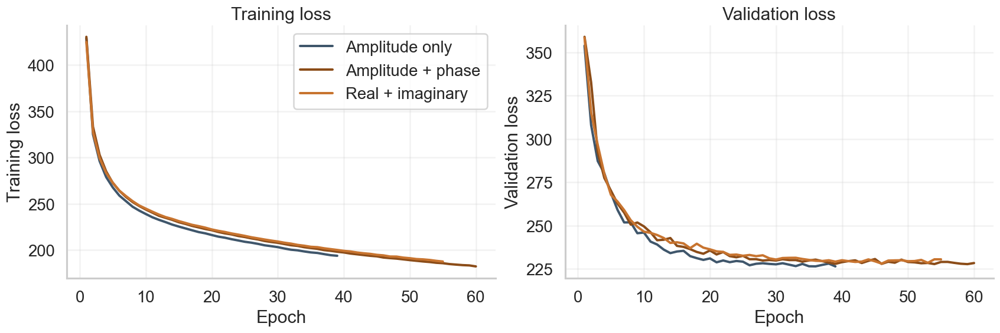
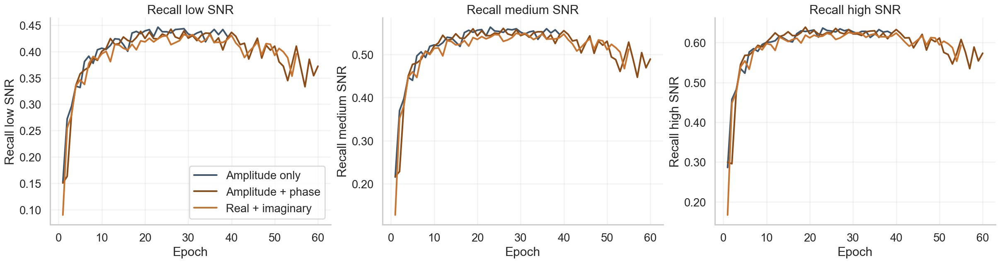

**Table 1.** Single-resolution ablation comparing amplitude-only, amplitude+phase, and real+imaginary inputs.

| Representation | mAP50:95 | mAP50 | Recall low SNR | Recall medium SNR | Recall high SNR | Params | FLOPs |
| --- | ---: | ---: | ---: | ---: | ---: | ---: | ---: |
| Amplitude only | 0.3396 | 0.3999 | 0.4420 | 0.5599 | 0.6327 | 2.88M | 629.64M |
| Amplitude + phase | 0.3127 | 0.3833 | 0.4369 | 0.5551 | 0.6305 | 2.88M | 632.00M |
| Real + imaginary | 0.3077 | 0.3671 | 0.4308 | 0.5475 | 0.6239 | 2.88M | 632.00M |

**Figure 1.** mAP versus training epochs.

**Figure 2.** Training loss versus epochs.

**Figure 3.** Recall versus training epochs.

